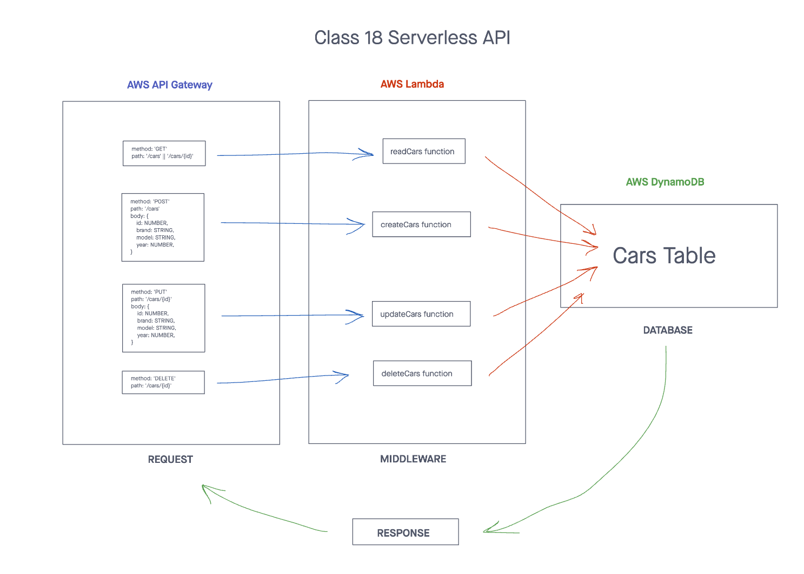

# Serverless API Put
> This repository utilizes AWS Cloud Servers such as API Gateway (Routing), AWS Lambda Functions (CRUD Operation Handlers), and AWS DynamoDB (Database) to accomplish a PUT requests.

## Installation

> Start with: `npm install`

## Usage

> To test, use: `npm test`

Get request:
```text
method: PUT
route: /cars/{id}
body: {
  id: NUMBER,
  brand: STRING,
  model: STRING,
  year: NUMBER,
}
```

Output:
> response with status code and body - updated car

## UML Diagram


## PR link
[PUT Request PR link](https://github.com/cleecoloma/serverless-api-put/pulls)

## Contributors
* Chester Lee Coloma
* ChatGPT helped with the tests